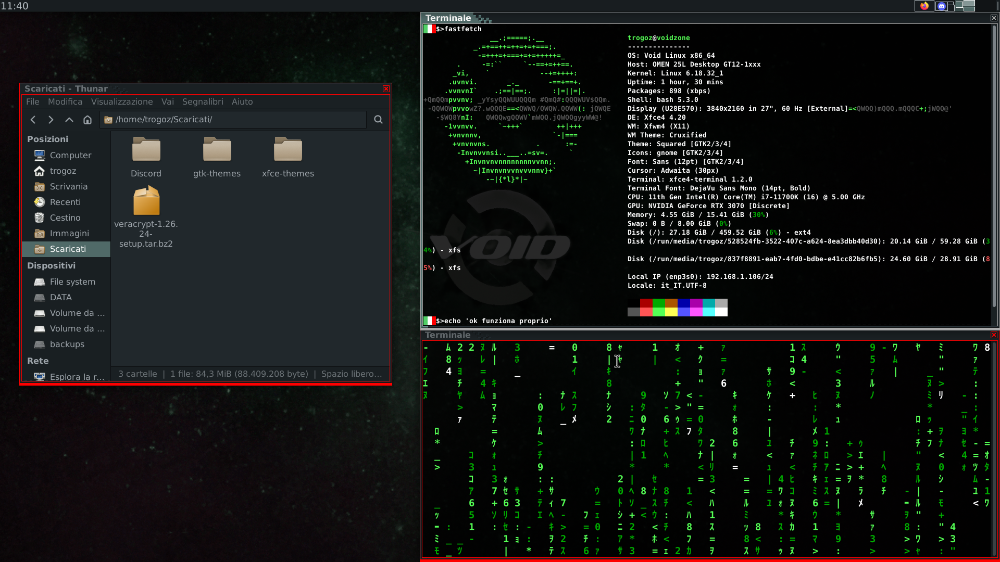

# cruxified
A modified GTK3 theme for XFCE4

[xfce theme page](https://www.opendesktop.org/p/2363062/)

A slight modification of cruxish, with thickened and coloured window borders:
bright for active and red for inactive.
The border colours are editable freely in themerc file.

Preview:

